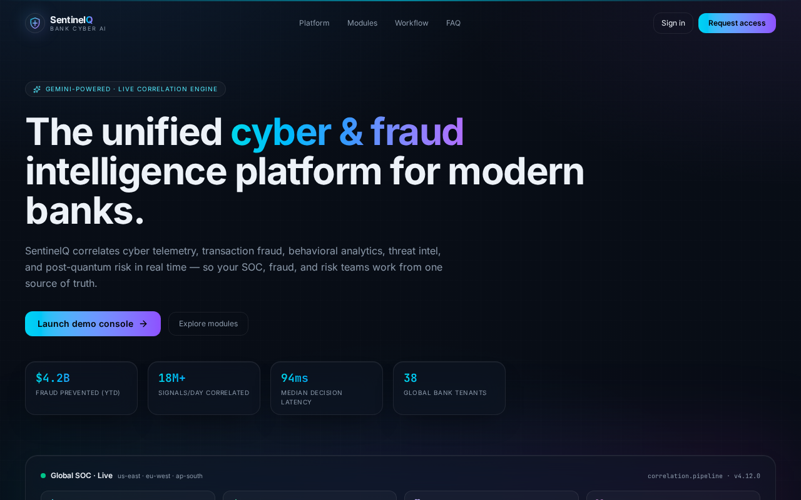

# Sentinel-Q

AI-assisted security operations console — real-time dashboards, alerts, investigations, transactions, telemetry, threat intel, and reports tailored to SOC Analyst, Investigator, Risk Manager, and Executive roles.

**Live app:** https://sentinel-q.today
**Repo:** https://github.com/Piyushsahu99/sentineiq



---

## Features

- Role-based sign-up (SOC Analyst / Investigator / Risk Manager / Executive) with server-enforced RLS
- KPI dashboards, alert triage, and case investigation flows
- Transactions ledger with anomaly scoring
- Telemetry stream and threat-intel feed
- Live threat map (Leaflet + OpenStreetMap tiles)
- One-click demo-data seeding from Settings
- Transactional email via a verified custom domain
- Executive reports view

## Tech stack

| Layer      | Choice                                                         |
| ---------- | -------------------------------------------------------------- |
| Framework  | TanStack Start v1 (React 19, SSR on Cloudflare Workers)        |
| Build      | Vite 7                                                         |
| Styling    | Tailwind CSS v4 + shadcn/ui                                    |
| Data       | TanStack Query + TanStack Router (file-based routes + loaders) |
| Backend    | Supabase (Postgres, Auth, Storage, Edge, RLS)                  |
| Maps       | Leaflet + OpenStreetMap                                        |
| Email      | Transactional email on `notify.sentinel-q.today`               |

## Project structure

```
src/
├── routes/                 file-based routes
│   ├── __root.tsx          root layout, head metadata
│   ├── index.tsx           landing page
│   ├── _app.*.tsx          authenticated app shell + pages
│   ├── auth.*.tsx          sign-in, role selection
│   └── api/                server routes (webhooks, cron)
├── components/             UI + feature components (sq/, ui/)
├── lib/*.functions.ts      TanStack server functions (RPC)
├── hooks/                  data hooks (useDashboardStats, useAlerts…)
├── integrations/supabase/  auto-generated backend client (do not edit)
└── styles.css              Tailwind v4 theme tokens
supabase/migrations/        SQL schema, RLS policies, GRANTs
docs/                       screenshots, smoke tests
```

## Getting started

```bash
bun install
cp .env.example .env       # fill in publishable backend keys
bun dev                    # http://localhost:8080
```

### First run

1. Sign up on `/auth` and pick a role on `/auth/role-select`.
2. Open **Settings → Seed demo data** to populate dashboards for your user.
3. All modules (Dashboard, Alerts, Transactions, Investigations, Telemetry, Threat Intel, Reports) now render live data.

## Secrets & security

- **Only publishable keys** live in `.env` (safe for the browser). The real `.env` is git-ignored; `.env.example` is the committed template.
- Service-role keys, signing secrets, and third-party API keys are stored as backend secrets, never in the repo.
- Row-Level Security is enabled on every public table; `GRANT`s are pinned per migration.
- Roles are stored in a separate `user_roles` table and checked via a `SECURITY DEFINER` `has_role()` function to prevent privilege-escalation.
- Public API routes live under `src/routes/api/public/*` and verify signatures inside the handler.

## Deployment

Deployed at [sentinel-q.today](https://sentinel-q.today) (with `www.sentinel-q.today`). CI builds and ships from `main` automatically.

## License

Proprietary — all rights reserved.
